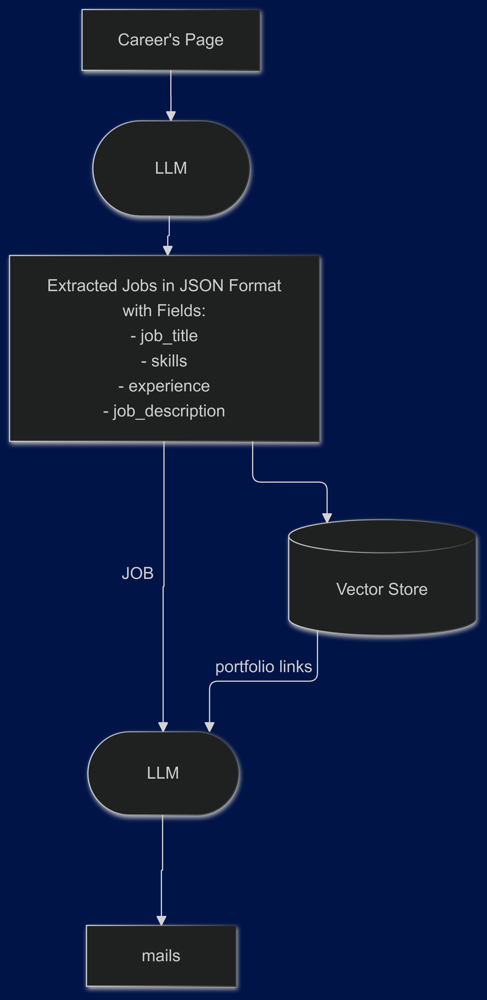
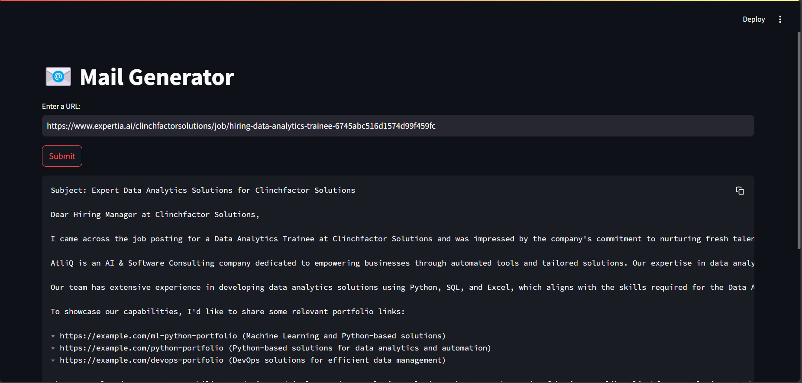

# 📧 Mail Generator

A **Streamlit-based AI-powered Cold Email Generator** designed to simplify client outreach by automating the process of scraping job descriptions, matching skills to portfolio projects, and generating personalized emails. This tool is ideal for business development teams aiming to create tailored and impactful outreach with minimal effort.

---

## 🚀 Features

1. **Job Description Extraction**  
   - Scrapes job listings from a provided URL.  
   - Extracts roles, experience, skills, and job descriptions in structured JSON format.  

2. **Portfolio Matching**  
   - Matches job requirements to your portfolio using AI-powered skill mapping with **ChromaDB**.  
   - Fetches the most relevant portfolio projects to showcase.  

3. **Cold Email Generation**  
   - Generates personalized cold emails with project links using **LangChain LLM**.  
   - Emails are designed to highlight AtliQ's expertise and capabilities.  

4. **Interactive User Interface**  
   - Built using **Streamlit** for an intuitive and user-friendly experience.

---

## 🛠️ Tech Stack

- **Frontend:** Streamlit  
- **Backend:** Python  
- **Database:** ChromaDB for vector similarity search  
- **AI Tools:** LangChain, GROQ API  
- **Data Processing:** Pandas  
- **Other Tools:** Regex for text cleaning  

---

## 📦 Installation

1. **Clone the Repository**  

   ```bash
   git clone https://github.com/your-repo/mail-generator.git
   cd mail-generator
   ```

2. **Set Up Virtual Environment**

   ```bash
   python -m venv venv
   source venv/bin/activate    # For macOS/Linux
   venv\Scripts\activate       # For Windows
   ```

3. **Install Dependencies**

   ```bash
   pip install -r requirements.txt
   ```

4. **Set Up Environment Variables**  
   - Create a `.env` file in the root directory.  
   - Add your **GROQ API Key**:
  
     ```plaintext
     GROQ_API_KEY="your_api_key_here"
     ```

5. **Prepare Portfolio Data**  
   - Add your portfolio data to `resource/my_portfolio.csv` in the format:

```bash
   Techstack,Links
   Python, Django, MySQL,https://example.com/python-portfolio
```

6. **Run the Application**

   ```bash
   streamlit run main.py
   ```

---

## 🖼️ Project Architecture



---

## 🖼️ Project Demo Screenshot



---

## 🎥 Project Demo Video


---

## 📖 Usage

1. Enter the **job listing URL** into the text box on the Streamlit app.  
2. Click the **Submit** button.  
3. The app will:  
   - Scrape and clean the job description.  
   - Match relevant portfolio projects.  
   - Generate and display a cold email tailored to the job listing.  

---

## 🗂 Project Structure

```plaintext
app
├── chains.py          # Handles LLM tasks like job extraction and email generation
├── portfolio.py       # Manages portfolio data and skill-based matching
├── main.py            # Streamlit app logic and UI
├── utils.py           # Utility functions for text cleaning
├── resource/
│   └── my_portfolio.csv  # Portfolio data
├── requirements.txt   # Python dependencies
├── .env               # Environment variables (GROQ API key)
└── README.md          # Project documentation
```

---

## ✨ Future Enhancements

- **Improved Skill Matching:** Enhance matching accuracy using embeddings for skills and portfolio projects.  
- **Customizable Emails:** Allow users to adjust the tone, style, or specific content of the email.  
- **Portfolio Management UI:** Enable uploading and editing portfolio data directly from the app.  
- **Multi-language Support:** Generate emails in different languages for global outreach.  

 
